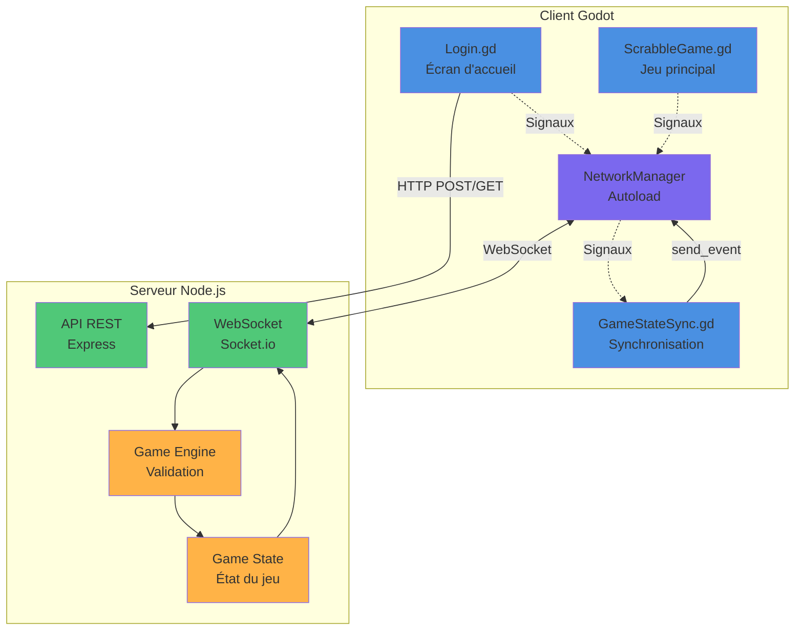
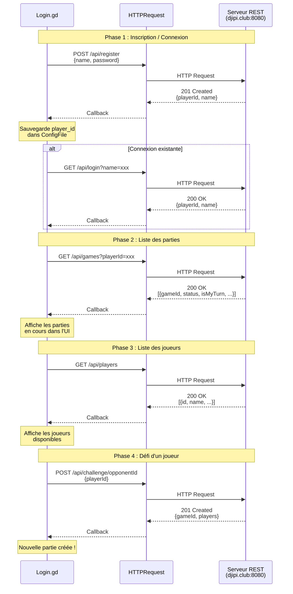
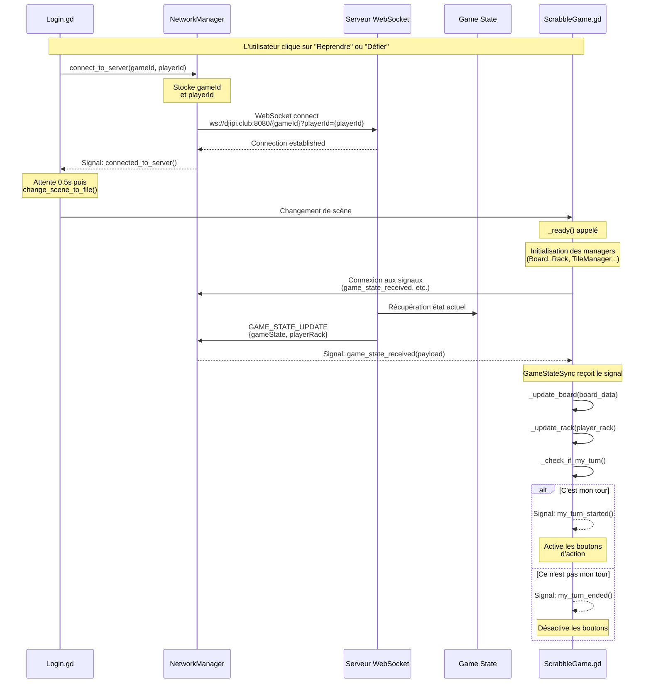
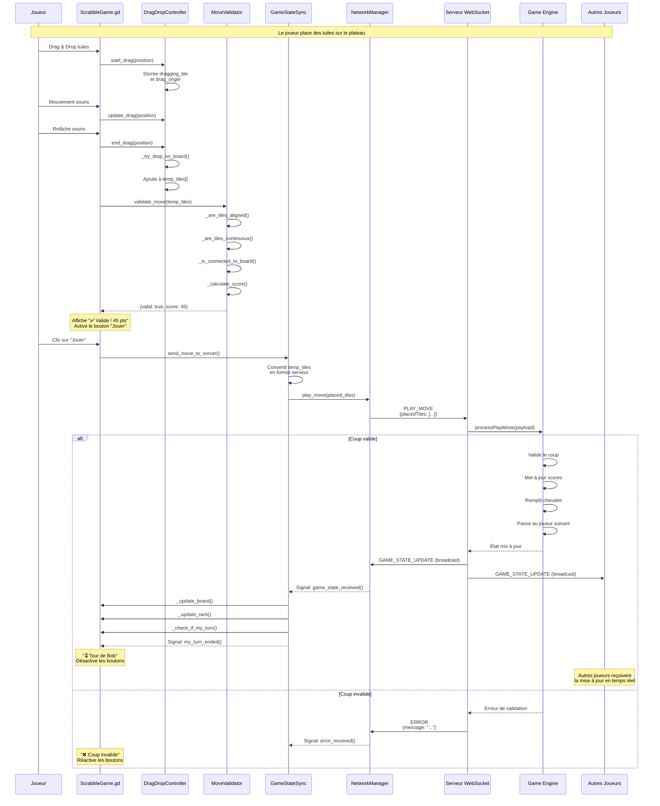
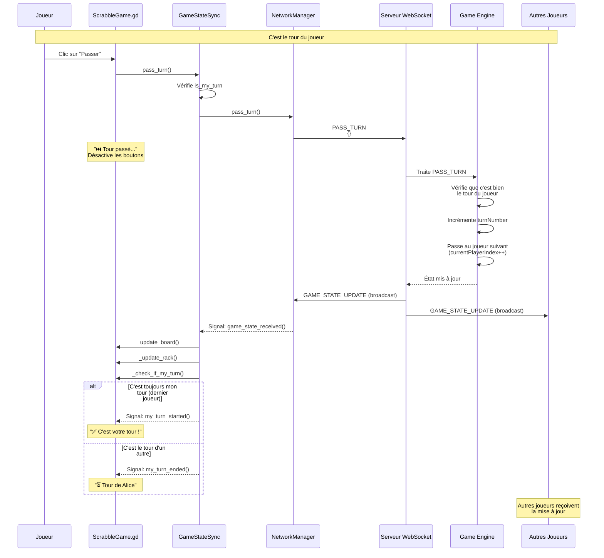
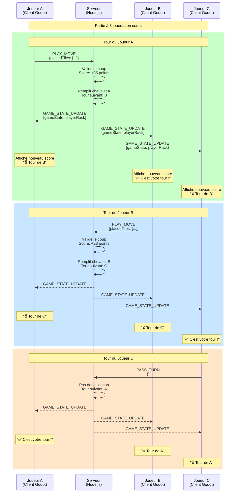
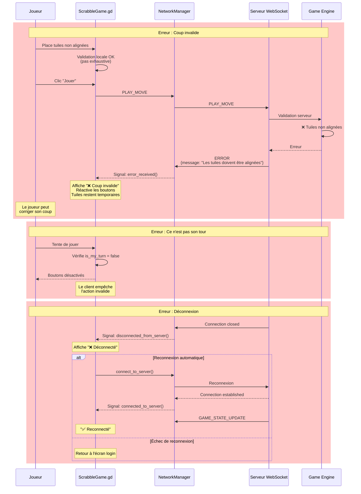
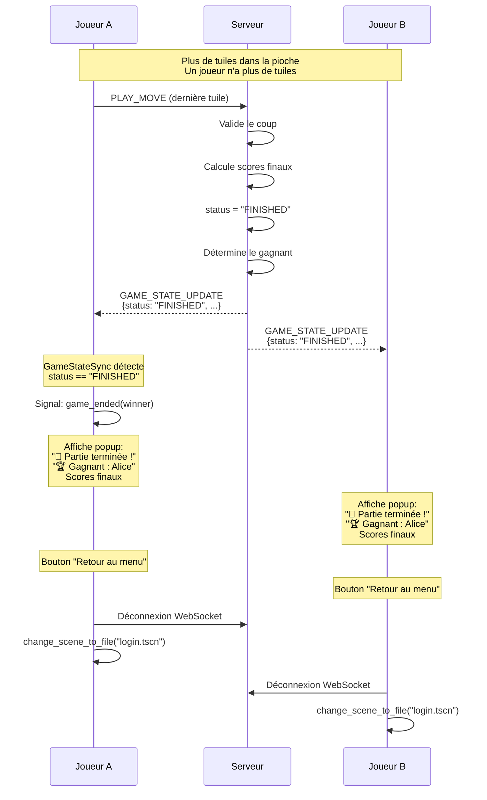

# Schémas des Flux de Communication - Scrabble Multijoueur

Ce document présente les différents flux de communication entre le client Godot et le serveur Node.js.

---

## Vue d'Ensemble - Architecture Complète



---

## Flux 1 : Authentification et Liste des Parties



---

## Flux 2 : Connexion WebSocket et Initialisation



---

## Flux 3 : Jouer un Coup (PLAY_MOVE)



---

## Flux 4 : Passer son Tour (PASS_TURN)



---

## Flux 5 : Synchronisation Multi-Joueurs



---

## Flux 6 : Gestion des Erreurs



---

## Flux 7 : Fin de Partie



---

## Flux 8 : Structure des Données Échangées

```mermaid
graph LR
    subgraph "Client Godot - Format Interne"
        GT[Godot Tile<br/>{letter, value, id, is_joker}]
        GB[Godot Board<br/>Array 15x15 de Dictionary]
        GR[Godot Rack<br/>Array de 7 Dictionary]
    end
    
    subgraph "Conversion"
        C1[_convert_godot_tile_to_server]
        C2[_convert_server_tile_to_godot]
    end
    
    subgraph "Serveur Node.js - Format API"
        ST[Server Tile<br/>{id, letter, points, isJoker}]
        SB[Server Board<br/>Array 15x15 de Object]
        SR[Server Rack<br/>Array de Object]
    end
    
    GT -->|Envoi| C1
    C1 --> ST
    
    ST -->|Réception| C2
    C2 --> GT
    
    GB -.-> GR
    SB -.-> SR
    
    style GT fill:#4A90E2
    style GB fill:#4A90E2
    style GR fill:#4A90E2
    style C1 fill:#FFB347
    style C2 fill:#FFB347
    style ST fill:#50C878
    style SB fill:#50C878
    style SR fill:#50C878
```

---

## Récapitulatif des Événements

### Client → Serveur (WebSocket)

| Événement | Description | Payload | Réponse |
|-----------|-------------|---------|---------|
| `PLAY_MOVE` | Jouer un coup | `{placedTiles: [...]}` | `GAME_STATE_UPDATE` ou `ERROR` |
| `PASS_TURN` | Passer son tour | `{}` | `GAME_STATE_UPDATE` |

### Serveur → Client (WebSocket)

| Événement | Description | Quand | Destinataire |
|-----------|-------------|-------|--------------|
| `GAME_STATE_UPDATE` | Synchronisation état | Connexion initiale, après chaque action | Tous les joueurs |
| `ERROR` | Erreur d'action | Action invalide | Joueur concerné uniquement |

### Client → Serveur (REST API)

| Endpoint | Méthode | Description | Réponse |
|----------|---------|-------------|---------|
| `/api/register` | POST | Inscription | `{playerId, name}` |
| `/api/login` | GET | Connexion | `{playerId, name}` |
| `/api/games` | GET | Liste des parties | `[{gameId, status, ...}]` |
| `/api/players` | GET | Liste des joueurs | `[{id, name, ...}]` |
| `/api/challenge/:id` | POST | Défier un joueur | `{gameId, players}` |

---

## Légende des Couleurs

- 🔵 **Bleu** : Composants Client (Godot)
- 🟢 **Vert** : Composants Serveur (Node.js)
- 🟠 **Orange** : Logique métier / Validation
- 🟢 **Vert clair** : Actions valides
- 🔴 **Rouge clair** : Erreurs / Actions invalides
- 🟡 **Jaune clair** : Transitions d'état

---

## Notes Importantes

1. **Tous les événements WebSocket** sont au format JSON : `{type: "...", payload: {...}}`
2. **La synchronisation est en temps réel** : tous les joueurs reçoivent `GAME_STATE_UPDATE` simultanément
3. **Le chevalet est privé** : chaque joueur ne reçoit que son propre chevalet dans `playerRack`
4. **La pioche est masquée** : les clients ne voient que le nombre de tuiles restantes
5. **Les tuiles verrouillées** (`isLocked: true`) ne peuvent pas être déplacées
6. **Le client fait une validation locale** (légère) avant d'envoyer au serveur
7. **Le serveur fait la validation finale** (complète) et renvoie une erreur si invalide
